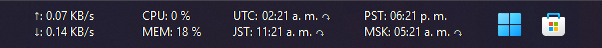

# 🕜Clocks

## Display world clocks on your Windows taskbar

**English | [Español](./README_es.md) | [日本語🤖](./README_ja.md) | [简体中文🤖](./README_zh-CN.md)**

### Overview

Clocks is a plugin for [TrafficMonitor](https://github.com/zhongyang219/TrafficMonitor/blob/master/README_en-us.md) that allows you to display clocks from various time zones directly in your Windows taskbar, so you can keep track of the time at different locations with ease.

### Requirements

- [TrafficMonitor](https://github.com/zhongyang219/TrafficMonitor/releases)
- Windows 10 1803 or superior

### Installation steps

1. Download a pre-built binary or build it from source (build instructions pending).
    - [Clocks for the x64 architecture](https://github.com/Yzen90/clocks/releases/latest/download/clocks-x64.zip)
    - [Clocks for the x86 architecture](https://github.com/Yzen90/clocks/releases/latest/download/clocks-x86.zip)
2. Place the `clocks.dll` file into TrafficMonitor's plugins directory.
3. Open or restart TrafficMonitor to load the plugin.
4. The Clocks configuration window will open automatically if no existing settings are found:

5. Navigate through the TrafficMonitor settings to enable and manage the displayed clocks:

 

6. A restart of TrafficMonitor may be required after adding or removing clocks to apply changes and display new items.

### Build from source

Note: Currently, detailed build instructions are not available. However, you can open an issue to request the build instructions to be added here.

---

©2025 Edgar Montiel Cruz

  

