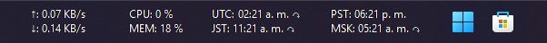
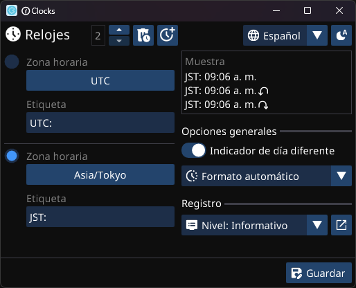
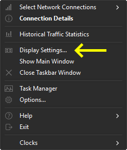
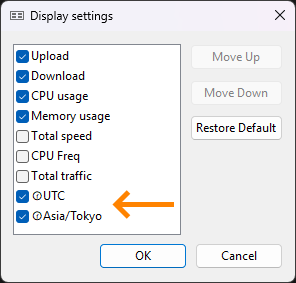

# 🕜Clocks

## Relojes mundiales para la barra de tareas de Windows

**[English](./README.md) | Español | [日本語🤖](./README_ja.md) | [简体中文🤖](./README_zh-CN.md)**

### Descripción general

Clocks es un plugin para [TrafficMonitor](https://github.com/zhongyang219/TrafficMonitor/blob/master/README_en-us.md) que te permite mostrar relojes de diferentes zonas horarias directamente en la barra de tareas de Windows, para que puedas mantener un seguimiento sencillo de la hora en distintos lugares.

### Requisitos

- [TrafficMonitor](https://github.com/zhongyang219/TrafficMonitor/releases)
- Windows 10 1803 o superior

### Pasos de instalación

1. Descarga un binario precompilado o compílalo a partir del código fuente (las instrucciones de compilación están pendientes).
    - [x64](https://github.com/Yzen90/clocks/releases/latest/download/clocks-x64.zip)
    - [x86](https://github.com/Yzen90/clocks/releases/latest/download/clocks-x86.zip)
2. Coloca el archivo `clocks.dll` en el directorio "plugins" de TrafficMonitor.
3. Abre o reinicia TrafficMonitor para cargar el plugin.
4. La ventana de configuración de Clocks se abrirá automáticamente si no hay un archivo de configuración existente:

1. Navega por la configuración de TrafficMonitor para habilitar y administrar los relojes:

 

6. Puede que sea necesario reiniciar TrafficMonitor después de agregar o eliminar relojes para aplicar los cambios y que se muestren los nuevos elementos.

### Compilar a partir del código fuente

Nota: Actualmente, no se proporcionan instrucciones detalladas de compilación. Sin embargo, puedes abrir issue para solicitar que se agreguen las instrucciones de compilación aquí.

---

©2025 Edgar Montiel Cruz

  

