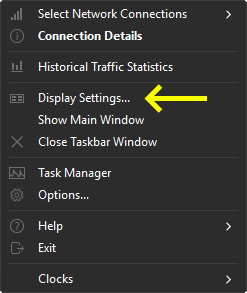

# 🕜Clocks

## Windowsタスクバーに世界時計を表示する

**[English](./README.md) | [Español](./README_es.md) | 日本語🤖 | [简体中文🤖](./README_zh-CN.md)**

### 概要

Clocksは、[TrafficMonitor](https://github.com/zhongyang219/TrafficMonitor)用のプラグインで、さまざまなタイムゾーンの時計をWindowsタスクバーに直接表示できるようにします。これにより、異なる場所の時間を簡単に追跡できます。

### インストール手順

1. 事前コンパイルされたバイナリをダウンロードするか、ソースコードからビルドします（ビルド手順はまだ用意されていません）。
    - [x64](https://github.com/Yzen90/clocks/releases/latest/download/clocks-x64.zip)
    - [x86](https://github.com/Yzen90/clocks/releases/latest/download/clocks-x86.zip)
2. `clocks.dll` ファイルをTrafficMonitorの「plugins」ディレクトリに配置します。
3. TrafficMonitorを開くか再起動してプラグインを読み込みます。
4. 設定ファイルが存在しない場合、Clocksの設定ウィンドウが自動的に開きます：

1. TrafficMonitorの設定をナビゲートして、表示される時計を有効にして管理します：

 

6. 時計を追加または削除した後は、変更を適用して新しいアイテムを表示するために、TrafficMonitorの再起動が必要になる場合があります。

### ソースコードからビルド

注記: 現在、詳細なビルド手順は提供されていません。しかし、ここにビルド手順を追加するようリクエストするissueを開くことができます。

---

©2025 Edgar Montiel Cruz

