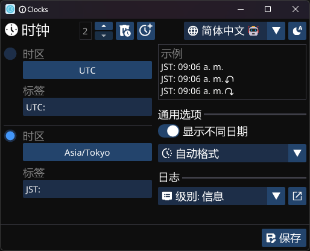
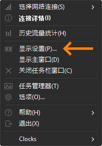
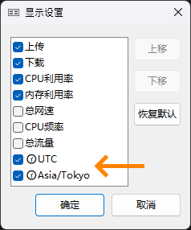

# 🕜Clocks

## 在Windows任务栏上显示世界时钟

**[English](./README.md) | [Español](./README_es.md) | [日本語🤖](./README_ja.md) | 简体中文🤖**

### 概述

时钟是[TrafficMonitor](https://github.com/zhongyang219/TrafficMonitor)的一个插件，允许您在Windows任务栏上直接显示来自不同时区的时钟，以便您可以轻松跟踪不同地点的时间。

### 要求

- [TrafficMonitor](https://github.com/zhongyang219/TrafficMonitor/releases)
- Windows 10 1803 或更高版本

### 安装步骤

1. 下载预编译二进制文件或从源代码构建（构建说明待定）。
    - [x64](https://github.com/Yzen90/clocks/releases/latest/download/clocks-x64.zip)
    - [x86](https://github.com/Yzen90/clocks/releases/latest/download/clocks-x86.zip)
2. 将clocks.dll文件放入TrafficMonitor的插件目录。
3. 打开或重启TrafficMonitor以加载插件。
4. 如果没有找到现有设置，时钟配置窗口将自动弹出：

5. 浏览TrafficMonitor设置以启用和管理显示时钟：

 

6. 在添加或删除时钟后，可能需要重新启动TrafficMonitor以应用更改并显示新项目。

### 从源代码构建

注意：目前还没有详细的构建说明。然而，您可以打开问题请求在此处添加构建说明。

---

©2025 Edgar Montiel Cruz

  

